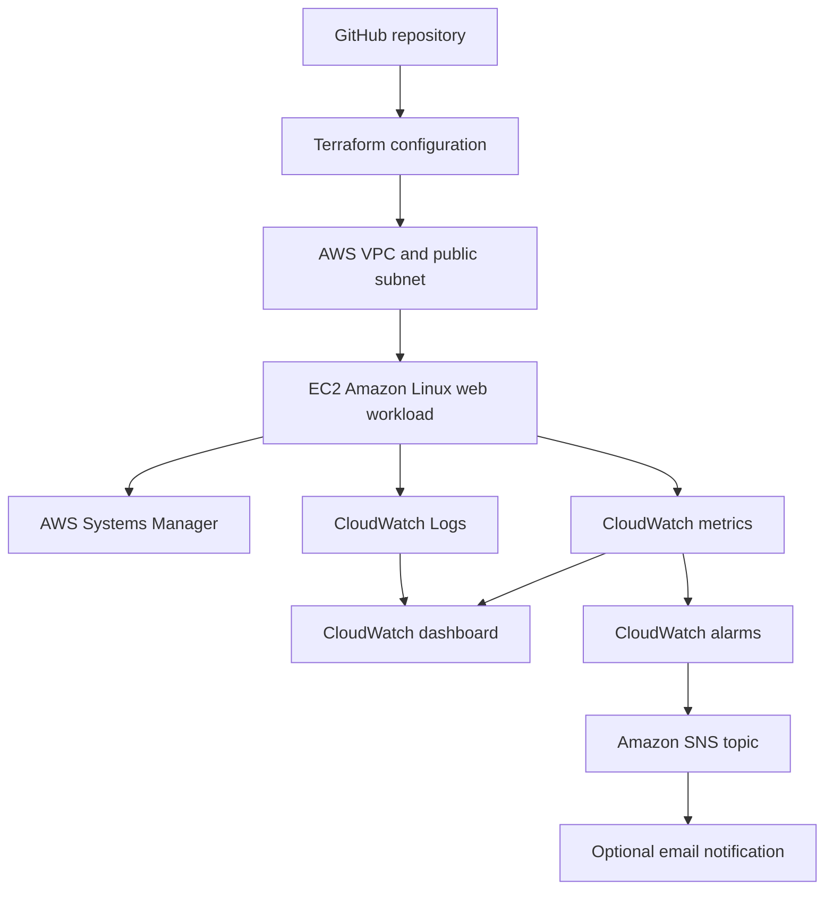

# AWS Observability and Incident Response Lab

Status: In progress

## Scenario

A small organization runs a Linux web workload in AWS. The operations team needs a secure way to administer the server, observe its health, receive alerts, and respond to a controlled service incident. The environment must be reproducible and easy to remove after testing.

## Objectives

- Provision the environment with Terraform
- Apply least-privilege IAM permissions
- Manage the instance with AWS Systems Manager instead of public SSH
- Collect operating-system and application logs in CloudWatch
- Create useful metrics, alarms, and an operations dashboard
- Send alarm notifications through Amazon SNS
- Simulate a controlled incident and follow a written runbook
- Produce an incident report with evidence and lessons learned
- Destroy all project resources after verification

## Planned Architecture



## Skills Demonstrated

- AWS IAM, VPC, EC2, Systems Manager, CloudWatch, and SNS
- Linux service management and log inspection
- Terraform fundamentals and reusable infrastructure
- Monitoring, alerting, troubleshooting, and incident documentation
- Security, cost awareness, and resource teardown

## Planned Repository Structure

```text
01-aws-observability-incident-response/
|-- README.md
|-- architecture/
|-- terraform/
|-- scripts/
|-- runbooks/
|-- incident-report/
`-- evidence/
```

## Local and Automated Validation

Run these checks before each infrastructure change:

```bash
terraform fmt -check -recursive
terraform init -backend=false -input=false
terraform validate -no-color
```

On Windows, after adding Terraform to `PATH`, the same checks can be run from
this project directory with:

```powershell
.\scripts\terraform-check.ps1
```

GitHub Actions repeats the checks on relevant pushes and pull requests. The
workflow validates configuration only; it never deploys or destroys resources.

## Completion Checklist

- [x] Cost guardrails reviewed before deployment
- [x] Architecture diagram created
- [x] Terraform configuration validated
- [x] No secrets or state files tracked by Git
- [ ] Instance reachable through Systems Manager
- [ ] Web workload produces expected logs
- [ ] Dashboard displays operational signals
- [ ] Alarm and SNS notification tested
- [ ] Controlled incident completed
- [ ] Recovery steps and root cause documented
- [ ] Infrastructure destroyed and AWS console checked for leftovers

## Safety Notes

- The project follows the repository-wide [AWS cost safety policy](../../docs/COST_SAFETY.md).
- The lab will use a dedicated least-privilege identity or role.
- No access keys, private keys, passwords, or Terraform state files will be committed.
- Current AWS pricing and Free Tier eligibility will be checked before deployment.
- AWS service credits will be verified separately from any AWS Skill Builder subscription before paid resources are created.
- The environment will be deployed only for the time needed to test it.

## Results

This section will be completed only after the environment has been deployed and verified.

For a file-by-file learning explanation, read the repository's [plain-English project guide](../../docs/PROJECT_GUIDE.md).

## Official References

- [Terraform AWS Provider](https://registry.terraform.io/providers/hashicorp/aws/latest/docs)
- [AWS Systems Manager instance permissions](https://docs.aws.amazon.com/systems-manager/latest/userguide/setup-instance-permissions.html)
- [CloudWatch agent installation](https://docs.aws.amazon.com/AmazonCloudWatch/latest/monitoring/download-CloudWatch-Agent-on-EC2-Instance-commandline-first.html)
- [CloudWatch agent configuration](https://docs.aws.amazon.com/AmazonCloudWatch/latest/monitoring/CloudWatch-Agent-Configuration-File-Details.html)
