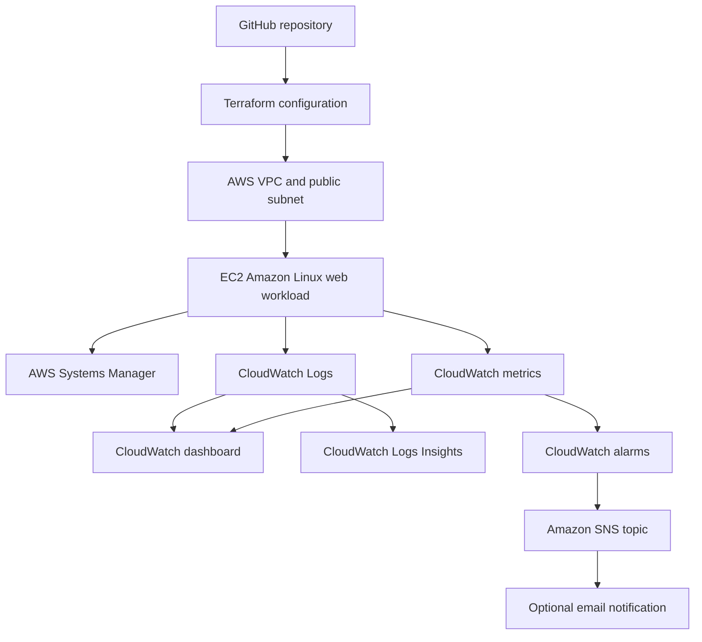

# AWS Observability and Incident Response Lab

Status: Live exercise completed on August 29, 2026; final IAM follow-up pending.

The temporary workload was removed after validation. This repository contains
the reproducible infrastructure and recorded results, not an always-on website.

## Scenario

A small organization runs a Linux web workload in AWS. The operations team needs a secure way to administer the server, observe its health, receive alerts, and respond to a controlled service incident. The environment must be reproducible and easy to remove after testing.

## Objectives

- Provision the environment with Terraform
- Apply least-privilege IAM permissions
- Manage the instance with AWS Systems Manager instead of public SSH
- Collect operating-system and application logs in CloudWatch
- Create useful metrics, alarms, and an operations dashboard
- Send alarm notifications through Amazon SNS
- Simulate a controlled incident and follow a written runbook
- Produce an incident report with evidence and lessons learned
- Destroy all project resources after verification

## Architecture



## Skills Demonstrated

- AWS IAM, VPC, EC2, Systems Manager, CloudWatch, and SNS
- Linux service management and log inspection
- Terraform fundamentals and reusable infrastructure
- Monitoring, alerting, troubleshooting, and incident documentation
- Security, cost awareness, and resource teardown

## Repository Structure

```text
01-aws-observability-incident-response/
|-- README.md
|-- architecture/
|-- terraform/
|-- scripts/
|-- queries/
|-- runbooks/
|-- incident-report/
|-- evidence/
|-- COST_ESTIMATE.md
`-- DEPLOYMENT.md
```

## Operating Procedure

Use the [deployment, verification, and teardown guide](DEPLOYMENT.md) for the
complete workflow. Review the [cost estimate](COST_ESTIMATE.md) before every
deployment and use the [CloudWatch Logs Insights query library](queries/cloudwatch-logs-insights.md)
during verification and incident response.

## Local and Automated Validation

Run these checks before each infrastructure change:

```bash
terraform fmt -check -recursive
terraform init -backend=false -input=false
terraform validate -no-color
terraform test -no-color
```

On Windows, after adding Terraform to `PATH`, the same checks can be run from
this project directory with:

```powershell
.\scripts\terraform-check.ps1
```

GitHub Actions repeats the checks on relevant pushes and pull requests. The test
suite uses a mocked AWS provider to verify security and cost controls without
credentials or cloud resources. The workflow never deploys or destroys resources.

## Completion Checklist

- [x] Cost guardrails reviewed before deployment
- [x] Architecture diagram created
- [x] Terraform configuration validated
- [x] No secrets or state files tracked by Git
- [x] Region, budget, and current account cost verified before deployment
- [x] Bounded incident-generation procedure documented
- [x] Dedicated non-root deployment role assumed
- [x] Instance reachable through Systems Manager
- [x] Web workload produces expected logs
- [x] Dashboard and operational metrics available
- [x] CPU alarm changed from OK to ALARM and back to OK
- [x] SNS action targets configured; external email delivery was not tested
- [x] Controlled incident completed
- [x] Recovery steps and root cause documented
- [x] Infrastructure destroyed and service-level leftover checks completed
- [ ] Final alarm-history read permission deployed and verified

## Safety Notes

- The project follows the repository-wide [AWS cost safety policy](../../docs/COST_SAFETY.md).
- The lab will use a dedicated least-privilege identity or role.
- The approved deployment Region is `us-east-2`.
- Each deployment is limited to two hours with a conservative USD 0.60 cost ceiling.
- No access keys, private keys, passwords, or Terraform state files will be committed.
- Current AWS pricing and Free Tier eligibility will be checked before deployment.
- AWS service credits will be verified separately from any AWS Skill Builder subscription before paid resources are created.
- The environment will be deployed only for the time needed to test it.

## Results

The recorded run created 20 Terraform resources in `us-east-2`. Session Manager
access, HTTP responses, log streams, and memory metrics were verified. A bounded
12-minute CPU test triggered the high-CPU alarm; the alarm returned to OK after
the test ended. HTTP checks succeeded during the exercise. Terraform then
destroyed all 20 resources, and the recorded leftover checks returned zero.

Read the [incident report](incident-report/2026-08-29-high-cpu-event.md) and
[validation summary](evidence/2026-08-29-validation-summary.md) for the timeline,
observations, and limitations. These are operator-recorded historical results;
they are not a claim that AWS resources are running today.

The run verified alarm transitions and configured SNS targets. No email
subscriber was configured, so recipient delivery and successful SNS publication
are not independently proven by the retained evidence. The template includes
the follow-up `cloudwatch:DescribeAlarmHistory` permission; deployment of that
final permission still requires verification.

For a file-by-file learning explanation, read the repository's [plain-English project guide](../../docs/PROJECT_GUIDE.md).

## Official References

- [Terraform AWS Provider](https://registry.terraform.io/providers/hashicorp/aws/latest/docs)
- [AWS Systems Manager instance permissions](https://docs.aws.amazon.com/systems-manager/latest/userguide/setup-instance-permissions.html)
- [CloudWatch agent installation](https://docs.aws.amazon.com/AmazonCloudWatch/latest/monitoring/download-CloudWatch-Agent-on-EC2-Instance-commandline-first.html)
- [CloudWatch agent configuration](https://docs.aws.amazon.com/AmazonCloudWatch/latest/monitoring/CloudWatch-Agent-Configuration-File-Details.html)
- [CloudWatch dashboard body syntax](https://docs.aws.amazon.com/AmazonCloudWatch/latest/monitoring/CloudWatch-Dashboard-Body-Structure.html)
- [CloudWatch alarms with encrypted SNS topics](https://repost.aws/knowledge-center/cloudwatch-configure-alarm-sns)
